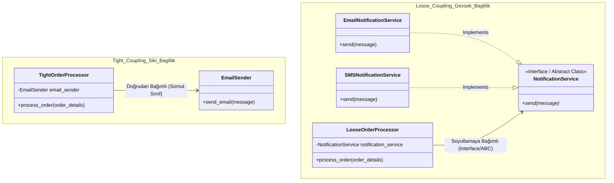

## Mimari Diyagramı (UML Sınıf Diyagramı)

Aşağıdaki diyagramda, sıkı bağlılık (Tight Coupling) ile gevşek bağlılık (Loose Coupling / Dependency Inversion) arasındaki mimari fark gösterilmektedir:

### Yapısal Açıklama:
1. **Sıkı Bağlılık (Tight Coupling):** `TightOrderProcessor`, e-posta göndermek için doğrudan somut `EmailSender` sınıfına bağlıdır. Başka bir bildirim yöntemine geçmek için kod değişikliği ve refactoring gerekir.
2. **Gevşek Bağlılık (Loose Coupling):** `LooseOrderProcessor`, somut sınıflar yerine `NotificationService` soyutlamasına (Interface / Abstract Class) bağlıdır. `EmailNotificationService` veya `SMSNotificationService` sınıfları bu arayüzü uyguladığı için sisteme yeni bir bildirim yöntemi eklemek var olan kodu değiştirmeyi gerektirmez (Open/Closed Principle).
